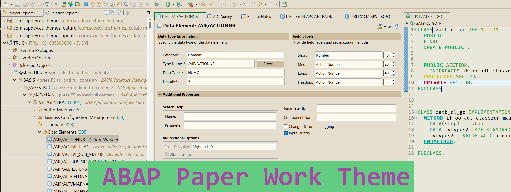

    
    <table>
        <tr>
            <td width="33%" align="center">
                <a href="https://github.com/attilaberencsi/zsapdev_agit">
                    
                      
                    <b>Reuse Libraries, Utilities and Samples</b>
                     
                    Branches: cloud, onPrem-2023
                </a>
            </td>
            <td width="33%" align="center">
                <a href="https://github.com/attilaberencsi/gwtools">
                    
                      
                    <b>Cache management and other tools</b>
                     
                    Branches: onPrem-2022
                </a>
            </td>
            <td width="33%" align="center">
                <a href="https://github.com/attilaberencsi/trlist">
                    
                      
                    <b>Status List</b>
                     
                    Branches: onPrem-2022
                </a>
            </td>
        </tr>
        <tr>
            <td width="33%" align="center">
                <a href="https://github.com/attilaberencsi/abapthemes">
                    
                      
                    <b>Eclipse Themes</b>
                     
                    ABAP Development Tool
                </a>
            </td>
            <td width="33%" align="center">
                <a href="https://github.com/attilaberencsi/freeflexcapts">
                    
                      
                    <b>Flexible Programming Model</b>
                     
                    TypeScript
                </a>
            </td>
            <td width="33%" align="center">
                <a href="https://github.com/attilaberencsi/UI5_from_scratch">
                    
                      
                    <b>UI5 Freestyle App</b>
                     
                    OData, TypeScript
                </a>
            </td>
        </tr>
        <tr>
            <td width="33%" align="center">
                <a href="https://github.com/attilaberencsi/abapcloudcertificate">
                    
                      
                    <b>Certificate Code Samples</b>
                     
                    Branches: cloud, onPrem-2019
                </a>
            </td>
            <td width="33%" align="center">
                <a href="https://attilaberencsi.github.io/favorites2/">
                    
                      
                    <b>Favorites</b>
                     
                    github.io
                </a>
            </td>
            <td width="33%" align="center">
                <a href="https://github.com/attilaberencsi/cdsfindanno">
                    
                      
                    <b>Annotation Sample Finder</b>
                     
                    Branches: onPremise only
                </a>
            </td>
        </tr>
        <tr>
        <td colspan="3">
        
        </td>
        </tr>
    </table>

