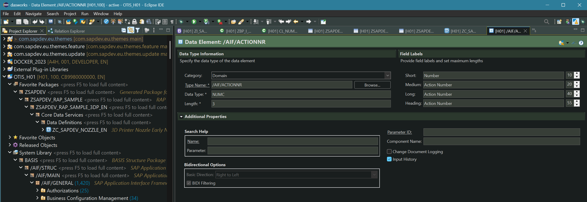

  <table>
    <tr>
      <td width="33%" style="border:2px solid #2196f3;">
        <a href="https://github.com/attilaberencsi/zsapdev_agit/tree/cloud"><b>RAP Reuse Libraries, Utilities and Samples</b></a>
         
        Branches: cloud, onPrem-2023
      </td>
      <td width="33%" style="border:2px solid #ff9800;">
        <a href="https://github.com/attilaberencsi/gwtools"><b>GateWay Cache management and other tools</b></a>
         
        Branches: onPrem-2022
      </td>
      <td width="33%" style="border:2px solid #4caf50;">
        <a href="https://github.com/attilaberencsi/trlist"><b>Transport Status List</b></a>
         
        Branches: onPrem-2022
      </td>
    </tr>
    <tr>
      <td width="33%" style="border:2px solid #f44336;">
        <a href="https://github.com/attilaberencsi/abapthemes"><b>Eclipse Themes</b></a>
         
        ABAP Development Tool
      </td>
      <td width="33%" style="border:2px solid #673ab7;">
        <a href="https://github.com/attilaberencsi/freeflexcapts"><b>Fiori Flexible Programming Model</b></a>
         
        TypeScript
      </td>
      <td width="33%" style="border:2px solid #ffeb3b;">
        <a href="https://github.com/attilaberencsi/UI5_from_scratch"><b>UI5 Freestyle App</b></a>
         
        OData V4, TypeScript
      </td>
    </tr>
    <tr>
      <td width="33%" style="border:2px solid #e91e63;">
        <a href="https://github.com/attilaberencsi/abapcloudcertificate"><b>ABAP Cloud Certificate Code Samples</b></a>
         
        Branches: cloud, onPrem-2019
      </td>
      <td width="33%" style="border:2px solid #00bcd4;">
        <a href="https://attilaberencsi.github.io/favorites2/"><b>Favorites</b></a>
         
        github.io
      </td>
      <td width="33%" style="border:2px solid #3f51b5;">
        <a href="https://github.com/attilaberencsi/cdsfindanno"><b>CDS Annotation Sample Finder</b></a>
         
        Branches: onPremise only
      </td>
    </tr>
    <tr>
    <td colspan="3" align="center" style="border:2px solid #795548;">
        
        

        ABAP PaperWork Theme
        

    </td>
    <tr>
    <td colspan="3" align="center" style="border:2px solid #795548;">
        
        

        ABAP Dark Theme
        

    </td>
    </tr> 
  </table>

